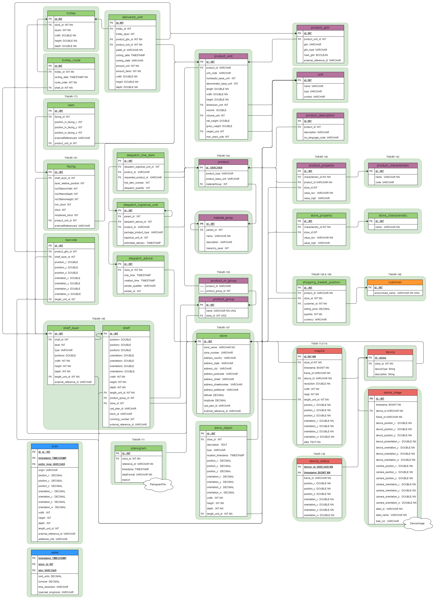
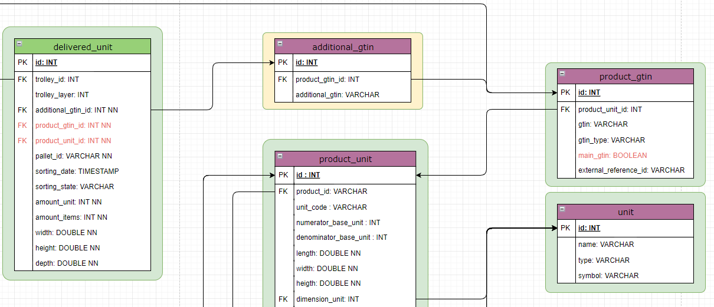

# K4R Digital Twin API

- [General Aspect of the DT API](#general-aspect-of-the-dt-api)
  - [Relation to K4R Project](#relation-to-k4r-project)
    - [API Documentation](#api-documentation)
  - [REST API and GraphQL](#relation-to-k4r-project)
  - [How do I get set up?](#how-do-i-get-set-up)
    - [As a DT API Developer](#as-a-dt-api-developer)
    - [As a Pilot Application Developer](#as-a-pilot-application-developer)
- [DT Data Model](#dt-data-model)
  - [Data Model Relationships](#data-model-relationships)
  - [Outlook](#outlook)
    - [Additional GTIN Extension](#additional-gtin-extension)
    - [Unit Entity](#unit-entity)
  - [Contributions](#contributions)

# General Aspect of the DT API

## Relation to K4R Project

This repository contains the source code for the digital twin (DT) APIs.
The Knowledge4Retail platform is based on concept of a DT model.
The DT model corresponds to a virtual representation of objects
and processes in a store. Due to the digitalization, retail processes
can be illustrated and optimized.
The variety of use cases in K4R uses the DT API as a
source of information and therefore forms the basis for applications.

## REST API and GraphQL

The stored data in the digital twin are available by REST API and GraphQL.
The REST API contains far more than 100 endpoints which are created
for the uses cases as well as the general return of the data.
The implementation of the REST API does not contain any business logic.
In addition to REST API, the data can also be transferred by GraphQL
due to the sake of speed and convenience.

Swagger UI enables a simple interaction and documentation of the REST API.
GraphiQL, on the other hand, enables an interface and documentation for
the GraphQL implementation.

### API Documentation

* Swagger documentation for the REST API is available under: \
  `{https://UrlOfTheRunningApiInstance}/k4r/swagger-ui.html`

* GraphiQL documentation for the GraphQL is given by: \
  `{https://UrlOfTheRunningApiInstance}/k4r/graphiql`

Example for GraphQL can be found in the Confluence of K4R.

## How do I get set up?

### As a DT API Developer

In order to run/debug the project locally using an In Memory Database, you need:

* Java SDK 17 (for example from [AdoptOpenJDK](https://adoptopenjdk.net/))
* [Maven Build Tool](https://maven.apache.org/)

### As a Pilot Application Developer

In order to build a running image or run/debug the project with a persistent database, you need:

* PostgreSQL docker container with a timescale DB extension (for example from [Timescale](https://hub.docker.com/r/timescale/timescaledb)).
* kafka docker container (for example from [Kafka](https://registry.hub.docker.com/r/wurstmeister/kafka)).
  Alternatively, one can also disable the kafka usage turning it off in the application properties file.

The required images can also be pulled by using the provided docker-compose file.
By using the dockerfile of the DT API one can create the docker container.

# DT Data Model

## Data Model Relationships

## Outlook

### Additional GTIN extension

The DT API model currently identify one product with the main GTIN
or an external reference id which uniquely identifies a product
within a company. Thus, there is a one-to-one correlation between the
main GTIN and the external reference id. The scan data from the robotics
robot provides the external reference id which than is added by the
main GTIN. Due to the one-to-one correlation an unambiguous assignment
to the correct product is available.

The GTIN is mainly used to identify the product and is therefore a
central part of many processes. For example, the use case of presorting where
delivered products from a palette must be sorted into trolleys.
However, by scanning a product or outer packaging one does
not necessarily get the main GTIN. Depending on the scan, different
variants of GTIN can be returned which can all assigned to the main
GTIN. In contrast, note that the robot scans the barcode which are attached
to a shelf layer. These barcodes encode the external reference ids
in contrast to scanning products from a delivered product in a palette.

In order to correctly apply the DT API one must map the additional
GTINs to the main GTIN. This can be solved by pursuing different
approaches. One possible solution is to extend the DT API model
by further entities which correctly handles the mapping. The other
solution is to first send a request to the SAP adapter to
get the corresponding main GTIN and then correctly interact with the
DT API.

In the following, the extension of the DT API one entity will be
shortly sketched. The new entity called additional GTIN is lighted
by a yellow shape and maps many additional GTIN from outer packages
or directly from a product to the main gain. Furthermore, the delivered
unit must then reference the additional GTIN by a foreign key
described by the additional GTIN id. The red lighted
attributes can then be deleted from the data model.

### Unit Entity

The unit entity must be filled manually with the needed units.
The SI units should be the preferred units. For instance, all
lengths are stored uniformly by the meter unit which corresponds
to the first element of the unit entity. The robotics scan contains
many lengths. These scan data are integrated into the DT API by applying
the camel adapter so that the scan service is called. Note that the
length unit in each DTO within the scan service is hard coded.
By establishing a convention for the complete DT, the code can
dynamically follow the conventions so that the hard coded part can be removed.

## Contributions

Merge requests to enhance the documentation, code or functionality are _highly welcomed & appreciated_ :thumbsup:
